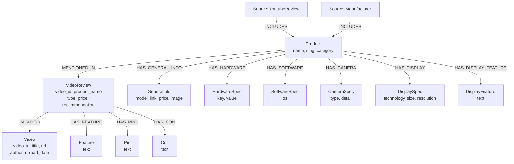

## 1. Dữ liệu có sẵn trong repo
**[youtube_links.txt](video-youtube/youtube_links.txt)**  
Chứa 130 link video YouTube review về 53 mẫu điện thoại (iPhone, Samsung, Xiaomi, OPPO, Realme, Vivo)  
**[phones_data.json](phones_data.json)**  
Thông số kỹ thuật đầy đủ của 53 mẫu điện thoại, thu thập từ CellphoneS, TGDĐ...    
**[youtube_reviews.json](phones_data.json)**  
Tổng hợp các thông tin review từ 130 video, nhóm theo tên của 53 mẫu điện thoại

## 2. Cách nhanh nhất để có dữ liệu trên Neo4j của bạn để chạy được DoraReviewer
**Bước 1:** Từ repo gốc, di chuyển vào thư mục **review_graph**
```bash
cd review_graph
```  
**Bước 2:** GIỮ file [youtube_reviews.json](video-youtube/youtube_reviews.json) đã có trong repo này  
**Bước 3:** Chạy file [graph_data.py](video-youtube/transcript_graph/graph_data.py) tự động Đẩy toàn bộ node + relationship lên Neo4j của bạn

👉 Thế là đã có dữ liệu để chạy hệ thống DoraReviewer!

## 3. Tổng quan pipeline xử lý video review trên Youtube và thông số kĩ thuật tổ chức dữ liệu lên Neo4j
Pipeline này trích xuất và tổ chức dữ liệu review sản phẩm từ video YouTube, sau đó lưu trữ dưới dạng đồ thị trong cơ sở dữ liệu Neo4j, bao gồm kết hợp xử lý audio, gpt-4-turbo để tóm tắt, và chuyển đổi dữ liệu thành cấu trúc đồ thị.  
### Các bước trong pipeline
#### 1. Tải Audio từ YouTube
- Đầu vào: Danh sách URL video YouTube.
- Thao tác: Tải audio từ từng video.
- Đầu ra: File .mp3 lưu trong thư mục [video-youtube/audio/](video-youtube/audio/).
#### 2. Chuyển Giọng Nói Thành Văn Bản
- Công cụ: faster-whisper.
- Thao tác: Chuyển audio thành transcript (văn bản).
- Đầu ra: Transcript thô.
#### 3. Tóm Tắt Review Bằng gpt-4-turbo
- Đầu vào: Transcript thô + prompt tùy chỉnh.
- Thao tác: Gửi lên gpt-4-turbo để trích xuất thông tin review có cấu trúc.
- Đầu ra: File JSON chứa thông tin review cho từng video trong thư mục [video-youtube/review_data/](video-youtube/review_data/)
#### 4. Gộp & Nhóm Dữ Liệu Review
- Đầu vào: 120 file JSON riêng lẻ trong thư mục [video-youtube/review_data/](video-youtube/review_data/)
- Thao tác: Gộp tất cả thành một file JSON duy nhất.
- Nhóm theo: Tên sản phẩm.
- Đầu ra: [youtube_reviews.json](video-youtube/youtube_reviews.json)
#### 5. Đẩy Dữ Liệu Lên Neo4j
- Đầu vào: [youtube_reviews.json](video-youtube/youtube_reviews.json) + [phones_data.json](phones_data.json).
- Thao tác: Chuyển dữ liệu thành node và relationship.
- Đầu ra: Đồ thị review sản phẩm trong Neo4j.

### Cách tạo 130 file JSON (từ 130 video Youtube) trong [video-youtube/review_data/](video-youtube/review_data/)
Chạy file **[main.py](video-youtube/main.py)** (PHẢI chạy file này từ thư mục **review_graph**)  
**Lưu ý:** muốn tạo 1 file JSON của 1 video thì
| Thứ cần kiểm tra                                                          | Trạng thái                    |
| --------------------------------------------------------------------------| ----------------------------- |
| File audio trong [video-youtube/audio/](video-youtube/audio)              | ❌ Chưa tồn tại               |
| File JSON trong [video-youtube/review_data/](video-youtube/review_data/)  | ❌ Chưa tồn tại               |
| Link YouTube                                                              | ✔️ Có trong [youtube_links.txt](video-youtube/youtube_links.txt) |

*Chúng tôi có sẵn 130 file JSON được tổng hợp sẵn từ 130 video Youtube rồi nên bạn có thể tiến đến bước gộp luôn, không cần tạo từng file JSON nữa.*  

#### 💡Tip khi muốn test nhanh bằng 1 video
- Hãy dán 1 link video review Youtube bất kì vào cuối file [youtube_links.txt](video-youtube/youtube_links.txt) (link video thêm vào phải chưa có trong file này) và chạy file main.py như đề cập ở trên.  

**Quan trọng:**
- Khi ra 1 file JSON có thể sẽ có 1 số từ bị sai như "OPPO Find X8" mà lại ghi thành "OPPO 5X8" nên phải lọc và sửa lại cho đúng thông tin.
- Phải nhất quán tên sản phẩm như "OPPO Find X8" thì tất cả file liên quan sản phẩm này đều phải ghi đúng tên như vậy (Tên sản phẩm phải trùng khớp với trường "canonical_name" trong file [phones_data.json](phones_data.json))

### Gộp 130 file JSON thành 1 file JSON chung nhóm theo tên sản phẩm
Chạy file [merge_transcript.py](video-youtube/transcript_graph/merge_transcript.py) (PHẢI chạy file này từ thư mục **review_graph**). Kết quả sẽ overwrite file [youtube_reviews.json](video-youtube/youtube_reviews.json) trong repo này.

### Tổ chức dữ liệu lên Neo4j
Như đã đề cập [Ở ĐÂY](#2-cách-nhanh-nhất-để-có-dữ-liệu-trên-neo4j-của-bạn-để-chạy-được-dorareviewer)    
Mô tả tổng qua tổ chức dữ liệu trên Neo4j:

